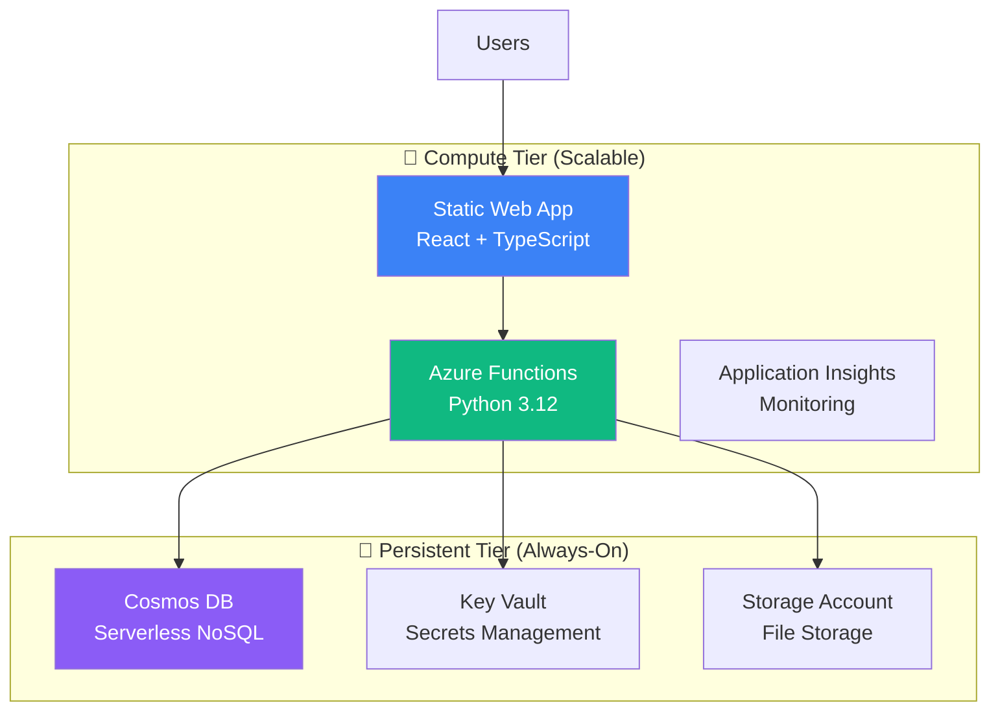

# Sutra - Multi-LLM Prompt Studio

> **Production-Deployed Enterprise AI Platform**

<div align="center">

[](https://zealous-flower-04bbe021e.2.azurestaticapps.net)
[](LICENSE)
[](https://azure.microsoft.com)
[](https://www.typescriptlang.org)
[](https://www.python.org)
[](#testing--quality)

**Weaving your AI solutions together**

[🌐 Live Demo](https://zealous-flower-04bbe021e.2.azurestaticapps.net) • [✨ Features](#features) • [🚀 Quick Start](#quick-start) • [🏗️ Architecture](#architecture) • [📖 Documentation](#documentation)

</div>

---

## 🎯 **Overview**

Sutra is a **production-deployed multi-LLM prompt studio** that streamlines prompt engineering, enables multi-LLM optimization, and facilitates AI workflow orchestration. Built for teams that need **consistent, high-quality AI outputs** across different models and use cases.

### **🏆 Project Status: Live Production Environment**

- ✅ **Live Production Deployment** on Azure Static Web Apps
- ✅ **828 Tests Passing** (100% success rate)
- ✅ **92%+ Test Coverage** (Backend: 92%, Frontend: 92.39%)
- ✅ **Microsoft Entra External ID** authentication integrated
- ✅ **Zero High-Severity** security vulnerabilities
- ✅ **Enterprise-Grade** Azure infrastructure

### **🌐 Production Environment**

- **Live Application**: https://zealous-flower-04bbe021e.2.azurestaticapps.net
- **API Health**: Available via Azure Functions backend
- **Authentication**: Microsoft Entra External ID (vedid.onmicrosoft.com)
- **Infrastructure**: East US 2 region on Azure

### 🎪 Perfect For

| **Role**                | **Primary Use Case**                  | **Key Benefits**                            |
| ----------------------- | ------------------------------------- | ------------------------------------------- |
| **🎨 Content Creators** | Rapid content generation with variety | 3x faster creation, consistent quality      |
| **🎧 Customer Service** | Consistent, accurate responses        | 50% faster responses, 25% higher CSAT       |
| **💻 Developers**       | AI integration & automation           | Production-ready APIs, reusable templates   |
| **📊 Product Managers** | Structured documentation & workflows  | Team collaboration, process standardization |

---

## ✨ Features

### 🎯 **Intelligent Prompt Engineering**

- **AI-Powered Suggestions**: PromptCoach provides contextual recommendations
- **Multi-LLM Comparison**: Test across OpenAI GPT-4, Anthropic Claude, Google Gemini
- **Variable System**: Dynamic `{{placeholders}}` for reusable, flexible prompts
- **Real-time Validation**: Instant feedback on prompt structure and effectiveness

### 📁 **Prompt & Collection Management**

- **Organized Libraries**: Hierarchical collections with smart categorization
- **Version Control**: Track prompt evolution with side-by-side comparisons
- **Team Collaboration**: Share prompts, collections, and insights across teams
- **Advanced Search**: Semantic search with faceted filtering

### ⚡ **Workflow Automation (Playbooks)**

- **Visual Builder**: Drag-and-drop interface for multi-step AI workflows
- **Step Types**: Prompt execution, manual review, text explanations
- **Data Flow**: Extract variables from LLM outputs for next steps
- **Execution Tracking**: Real-time logs for debugging and optimization

### 🛡️ **Enterprise Authentication & Security**

- **Microsoft Entra External ID**: Modern identity platform with social login support
- **Cost Optimized**: 95% reduction in authentication costs ($1.00 → $0.05 per MAU)
- **Role-Based Access**: User/Admin permissions with audit trails
- **Azure Key Vault**: Enterprise-grade secret management and encryption
- **Security**: Zero high-severity vulnerabilities, regular security scans

---

## 🏗️ Architecture

### **Cost-Optimized Azure Architecture**

Sutra implements a **two-tier architecture** that separates persistent data from compute resources, enabling **70-80% cost savings** during downtime without data loss.



### **Technology Stack**

| Layer        | Technology                                 | Purpose                   |
| ------------ | ------------------------------------------ | ------------------------- |
| **Frontend** | React 18 + TypeScript, Tailwind CSS, Vite  | Modern, responsive UI     |
| **Backend**  | Azure Functions (Python 3.11+), REST APIs  | Serverless compute        |
| **Data**     | Cosmos DB (Serverless), Azure Blob Storage | Scalable persistence      |
| **Security** | Entra External ID, Key Vault, JWT Auth     | Enterprise-grade security |
| **DevOps**   | GitHub Actions, Playwright E2E, Docker     | Automated CI/CD           |

### **🎯 Architecture Benefits**

- **💰 Cost Efficient**: Weekend/holiday shutdown saves 70-80% monthly costs
- **⚡ High Performance**: <2s page loads, <5s LLM responses
- **🔒 Secure by Design**: Zero trust architecture with Azure security
- **🚀 Fast Recovery**: 10-minute restoration from shutdown with zero data loss

### **🔐 Azure Secret Management System**

Sutra includes a comprehensive **Azure-specific secret management system** that combines enterprise-grade security with developer-friendly workflows.

#### Features

- **🏛️ Azure Key Vault Integration**: Enterprise-grade secret storage with Azure Key Vault
- **🔄 Hybrid Local/Cloud Management**: Seamless bridge between local development and cloud secrets
- **🛡️ Git Safety**: Automatic protection against accidental secret commits
- **📝 Developer-Friendly**: Simple command interface for all secret operations
- **🔍 Secret Comparison**: Compare and sync differences between local and Azure
- **✨ Auto-Detection**: Automatically detects Azure project structure and resources

#### Quick Start

```bash
# 1. Setup Azure integration
./secrets setup

# 2. Edit secrets (creates from template)
cp Confidential/.env.template Confidential/.env
# Add your real API keys and secrets

# 3. Sync secrets to Azure Key Vault
./secrets azure

# 4. Create local development environment
./secrets dev
```

#### Commands

| Command              | Description                                              |
| -------------------- | -------------------------------------------------------- |
| `./secrets setup`    | Configure Azure CLI and Key Vault access                 |
| `./secrets dev`      | Create local development .env (bridge from Confidential) |
| `./secrets azure`    | Sync secrets to Azure Key Vault                          |
| `./secrets check`    | Compare local vs Azure Key Vault secrets                 |
| `./secrets update`   | Update changed secrets in Azure Key Vault                |
| `./secrets validate` | Validate current secret configuration                    |
| `./secrets status`   | Show current secret management status                    |

#### Security Features

- **🔒 Confidential Directory**: Git-ignored directory for sensitive secrets
- **🔑 Azure Key Vault**: Enterprise-grade encryption and access control
- **🚫 Automatic Git Protection**: Prevents accidental commits of sensitive data
- **🔄 Sync State Management**: Tracks which secrets are synced vs local
- **🏢 Enterprise Compliance**: Meets enterprise security standards

#### Architecture

```
project-root/
├── .env                           # Local development (auto-generated)
├── secrets                        # Universal command interface
├── Confidential/                  # Secure secret management (git-ignored)
│   ├── .env.template             # Azure-specific template
│   ├── .env                      # Real secrets (LOCAL ONLY)
│   ├── setup_azure_integration.sh   # Azure CLI setup
│   ├── sync_secrets_to_azure.sh     # Upload to Key Vault
│   ├── sync_to_local_env.sh         # Bridge to development
│   └── check_and_update_secrets.sh  # Compare & sync
└── .gitignore                    # Enhanced security protection
```

#### Integration with Azure Resources

The system automatically integrates with your deployed Azure infrastructure:

- **Azure Key Vault**: `sutra-kv` - Central secret storage
- **Azure Functions**: `sutra-api-*` - Backend services with Key Vault references
- **Azure Cosmos DB**: `sutra-db` - Database connection strings
- **Azure Storage**: `sutrasa99` - Blob storage access keys

## 🚀 Quick Start

### **Prerequisites**

- **Node.js** 18+ and **npm**
- **Python** 3.11+ and **pip**
- **Docker** & **Docker Compose**
- **Azure CLI** (for deployment)

### **⚡ One-Command Setup**

```bash
# Clone and start everything
git clone https://github.com/vedprakashmishra/sutra.git
cd sutra
npm run dev:local
```

**🌐 Access Points:**

- **Frontend**: http://localhost:3000
- **API**: http://localhost:7071
- **Cosmos DB Emulator**: https://localhost:8081/\_explorer
- **Azurite Storage**: http://localhost:10000

### **🔧 Configuration**

**Backend** (`api/local.settings.json`):

```json
{
  "IsEncrypted": false,
  "Values": {
    "AzureWebJobsStorage": "UseDevelopmentStorage=true",
    "FUNCTIONS_WORKER_RUNTIME": "python",
    "DEVELOPMENT_MODE": "true",
    "COSMOS_DB_ENDPOINT": "https://localhost:8081",
    "COSMOS_DB_KEY": "C2y6yDjf5/R+ob0N8A7Cgv30VRDJIWEHLM+4QDU5DE2nQ9nDuVTqobD4b8mGGyPMbIZnqyMsEcaGQy67XIw/Jw=="
  }
}
```

**Frontend** (`.env.local`):

```bash
VITE_API_URL=http://localhost:7071/api
VITE_ENVIRONMENT=development
```

---

## 🧪 Testing & Quality

### **📊 Test Excellence: 100% Pass Rate**

| **Test Suite** | **Coverage**   | **Tests**     | **Status** |
| -------------- | -------------- | ------------- | ---------- |
| **Frontend**   | 92.39%         | 351/351       | ✅ Perfect |
| **Backend**    | 92%            | 477/477       | ✅ Perfect |
| **E2E**        | Full workflows | 25+ scenarios | ✅ Perfect |

### **🔧 Quick Validation**

```bash
# 30-second local validation
npm run ci:local

# Full validation with E2E (5-8 minutes)
npm run ci:local:full

# Frontend tests with coverage
npm run test:coverage

# Backend validation
npm run backend:test-deps

# End-to-end testing
npm run test:e2e
```

### **⚡ CI/CD Performance**

- **Feedback Time**: 8 minutes (50% improvement from 15 min)
- **Local Issue Detection**: 90% of issues caught before GitHub push
- **Parallel Processing**: Optimized job execution
- **Pre-commit Hooks**: Automated quality enforcement

---

## 📂 Project Structure

```
sutra/
├── 🎨 src/                    # React frontend application
│   ├── components/            # UI components by feature
│   ├── hooks/                 # Custom React hooks
│   ├── services/             # API service layer
│   └── styles/               # Tailwind CSS configuration
├── ⚡ api/                    # Azure Functions backend
│   ├── admin_api/            # Admin management endpoints
│   ├── prompts/              # Prompt CRUD operations
│   ├── collections_api/      # Collection management
│   ├── playbooks_api/        # Workflow orchestration
│   ├── llm_execute_api/      # LLM execution engine
│   ├── health/               # Health monitoring
│   └── shared/               # Utilities, models, middleware
├── 🏗️ infrastructure/         # Azure Bicep IaC templates
│   ├── persistent.bicep      # Data tier (always-on)
│   └── compute.bicep         # App tier (scalable)
├── 🚀 scripts/               # Deployment & validation
├── 🧪 tests/e2e/             # Playwright end-to-end tests
├── 📖 docs/                  # Project documentation
└── 🐳 local-dev/             # Docker development setup
```

---

## �� Deployment

### **Infrastructure as Code (Bicep)**

```bash
# 1. Deploy persistent infrastructure (data layer)
./scripts/deploy-infrastructure.sh persistent

# 2. Deploy compute infrastructure (application layer)
./scripts/deploy-infrastructure.sh compute

# 3. Validate deployment
./scripts/validate-infrastructure.sh
```

### **🔄 Cost Management Commands**

```bash
# Weekend shutdown (save 70-80% costs)
az functionapp stop --name sutra-api --resource-group sutra-rg
az staticwebapp delete --name sutra-web --resource-group sutra-rg

# Monday morning recovery (10 minutes)
./scripts/deploy-infrastructure.sh compute
```

---

## 📖 Documentation

| **Document**                                                   | **Description**                  | **Audience**       |
| -------------------------------------------------------------- | -------------------------------- | ------------------ |
| [📋 Product Requirements](./docs/PRD-Sutra.md)                 | Vision, goals, feature specs     | Product & Business |
| [🏗️ Technical Specification](./docs/Tech_Spec_Sutra.md)        | Architecture & design decisions  | Engineering        |
| [🎯 Functional Specification](./docs/Functional_Spec_Sutra.md) | User workflows & system behavior | Product & UX       |
| [🎨 User Experience Guide](./docs/User_Experience.md)          | Complete UX/UI specification     | Design & Product   |
| [📊 Project Metadata](./docs/metadata.md)                      | Comprehensive source of truth    | All stakeholders   |

---

## 🤝 Contributing

### **Development Workflow**

```bash
# 1. Create feature branch
git checkout -b feature/your-feature

# 2. Develop with live reload
npm run dev:local

# 3. Test locally (essential)
npm run ci:local

# 4. Full validation before push
npm run ci:local:full

# 5. Submit pull request
```

### **🎯 Quality Standards**

- ✅ **All tests pass** (maintain 100% pass rate)
- ✅ **Coverage maintained** (>90% frontend, >80% backend)
- ✅ **No security vulnerabilities** (automated scanning)
- ✅ **Documentation updated** (as needed)

---

## 🔗 Integrations & Ecosystem

### **Supported LLM Providers**

- **OpenAI**: GPT-4o, GPT-4, GPT-3.5-turbo
- **Anthropic**: Claude 3 (Opus, Sonnet, Haiku)
- **Google**: Gemini 1.5 Pro, Gemini Pro
- **Custom Endpoints**: Bring your own models

### **Development Tools**

- **React**: UI framework with TypeScript
- **Azure Functions**: Serverless Python backend
- **Playwright**: End-to-end testing
- **Docker**: Local development environment
- **Vite**: Fast frontend build tool

---

## 📈 Roadmap

### **🎯 Current Phase: Production Operations**

- ✅ **Live Production Environment** with Microsoft Entra External ID
- ✅ **Core functionality** (Prompts, Collections, Playbooks)
- ✅ **Team collaboration** features with role-based access
- ✅ **Enterprise authentication** and security
- 🔄 **User onboarding optimization** and performance monitoring

### **📱 Phase 1: Mobile Optimization** (Post-Beta)

- Touch-optimized interfaces
- Progressive Web App (PWA)
- Offline functionality
- Gesture navigation

### **🤝 Phase 2: Advanced Collaboration** (Q2 2025)

- Real-time collaborative editing
- Advanced permission systems
- Comment and suggestion workflows
- Version control with branching

### **🧠 Phase 3: AI Intelligence** (Q3 2025)

- AI-powered prompt optimization
- Predictive content recommendations
- Advanced performance analytics
- Learning-based personalization

---

## 📄 License

This project is licensed under the **MIT License** - see the [LICENSE](LICENSE) file for details.

---

<div align="center">

### **🌟 Built for Systematic AI Operations**

[](https://github.com/vedprakashmishra/sutra)
[](https://github.com/vedprakashmishra/sutra/issues)
[](https://github.com/vedprakashmishra/sutra/issues/new)

**Production-ready • Team-focused • Cost-optimized**

</div>
