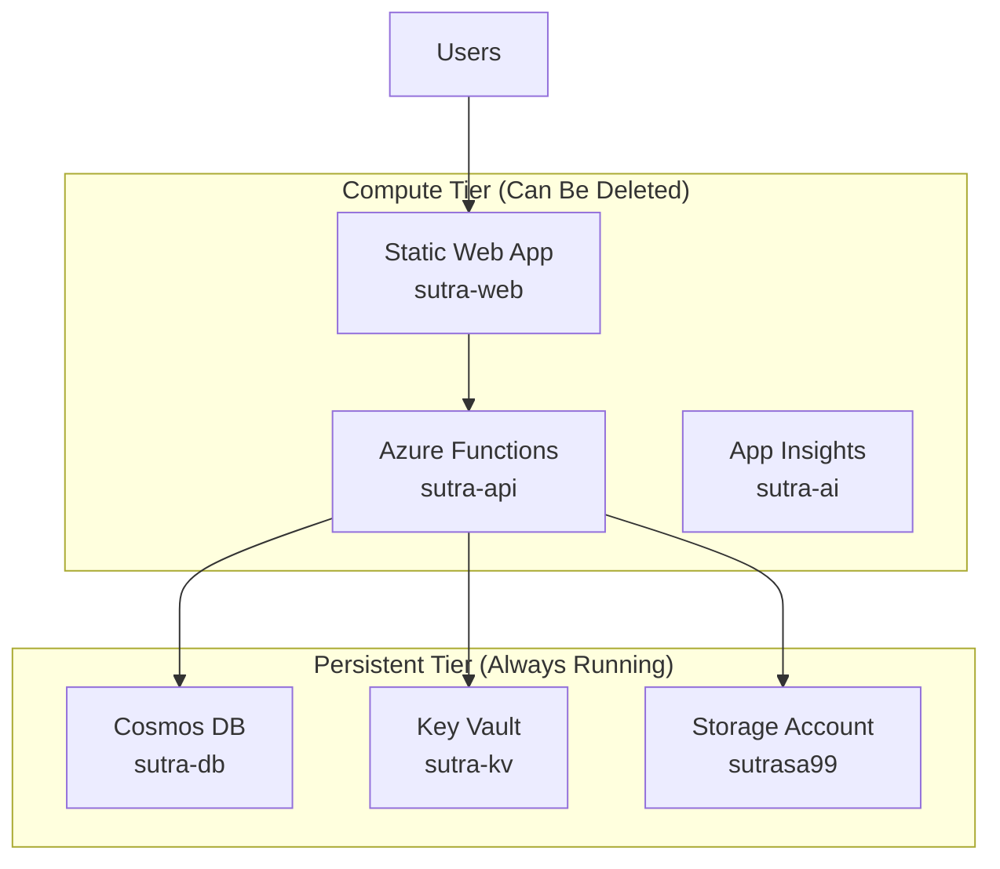

# Sutra - AI Operations Platform

> **Enterprise-grade AI workflow management with startup-friendly economics**

<div align="center">

[](https://github.com/your-username/sutra)
[](LICENSE)
[](https://azure.microsoft.com)
[](https://www.typescriptlang.org)
[](https://www.python.org)

**Weaving your AI solutions together**

[Features](#features) • [Quick Start](#quick-start) • [Architecture](#architecture) • [Documentation](#documentation)

</div>

---

## Overview

Sutra is a comprehensive AI operations platform designed for teams building AI-powered applications. It provides systematic prompt engineering, multi-LLM orchestration, and workflow automation with enterprise-grade reliability and startup-friendly cost optimization.

### 🎯 Built for Teams

- **Developers**: Streamline AI integration with reusable prompt templates and multi-provider testing
- **Product Teams**: Create and manage AI workflows without deep technical knowledge
- **Operations**: Monitor usage, control costs, and ensure compliance across all AI initiatives
- **Enterprises**: Scale AI operations with role-based access, audit trails, and budget controls

### ✨ Key Features

| Feature                               | Description                                                              |
| ------------------------------------- | ------------------------------------------------------------------------ |
| 🎯 **Intelligent Prompt Engineering** | AI-powered prompt suggestions with guided creation workflows             |
| 🔄 **Multi-LLM Optimization**         | Compare outputs across OpenAI, Anthropic, and Google models              |
| 📁 **Prompt Management**              | Organize prompts in collections with version control and collaboration   |
| ⚡ **Workflow Automation**            | Create reusable AI playbooks with step-by-step orchestration             |
| 👥 **Team Collaboration**             | Share prompts, workflows, and insights across teams                      |
| 🛡️ **Enterprise Controls**            | Budget management, usage monitoring, and role-based access               |
| 💰 **Cost Optimization**              | Two-tier Azure architecture enabling 70-80% cost savings during downtime |

## Architecture

Sutra uses a **cost-optimized two-tier Azure architecture** that separates persistent data from compute resources, enabling significant cost savings without data loss. The platform implements a **direct access architecture** optimized for small teams.

### 🏗️ Infrastructure Design



### 🚀 Direct Access Architecture

**Key Benefits**:

- **Cost Optimized**: No gateway or CDN costs (~$30-50/month savings)
- **Simple Deployment**: Direct endpoint access reduces complexity
- **Fast Performance**: No additional hops or proxy layers
- **Easy Debugging**: Direct access simplifies troubleshooting
- **Built-in Security**: Platform-managed HTTPS, custom rate limiting, authentication middleware

### 🛡️ Technology Stack

**Frontend**

- React 18 + TypeScript
- Tailwind CSS for responsive design
- Vite for fast development
- React Query for state management

**Backend**

- Azure Functions (Python 3.12)
- Direct access architecture with rate limiting
- REST API with OpenAPI documentation
- JWT authentication with Azure AD B2C

**Data & Storage**

- Azure Cosmos DB (NoSQL, serverless)
- Azure Blob Storage for files
- Azure Key Vault for secrets
- 30-day retention for cost optimization

**DevOps & Monitoring**

- Docker Compose for local development
- Playwright E2E testing
- GitHub Actions CI/CD
- Application Insights monitoring

## Quick Start

### Prerequisites

- Node.js 18+
- Python 3.12+
- Docker & Docker Compose
- Azure CLI (for deployment)

### 🚀 Local Development

```bash
# Clone the repository
git clone https://github.com/your-username/sutra.git
cd sutra

# Start the full development environment
npm run dev:local

# Access the application
# Frontend: http://localhost:3000
# Backend: http://localhost:7071
```

### 🧪 Testing

```bash
# Run end-to-end tests
npm run test:e2e

# Run backend tests
npm run backend:test-deps

# Validate CI/CD setup
npm run ci:validate
```

### 🔧 Environment Configuration

For local development, create these configuration files:

**Backend Configuration** (`api/local.settings.json`):

```json
{
  "IsEncrypted": false,
  "Values": {
    "AzureWebJobsStorage": "UseDevelopmentStorage=true",
    "FUNCTIONS_WORKER_RUNTIME": "python",
    "DEVELOPMENT_MODE": "true",
    "COSMOS_DB_ENDPOINT": "https://localhost:8081",
    "COSMOS_DB_KEY": "C2y6yDjf5/R+ob0N8A7Cgv30VRDJIWEHLM+4QDU5DE2nQ9nDuVTqobD4b8mGGyPMbIZnqyMsEcaGQy67XIw/Jw=="
  }
}
```

**Frontend Configuration** (`.env.local`):

```env
VITE_API_URL=http://localhost:7071/api
VITE_ENVIRONMENT=development
```

### 🚀 Deployment

Sutra uses Infrastructure as Code (Bicep) with a two-phase deployment process optimized for the direct access architecture:

```bash
# Deploy persistent infrastructure (data layer)
az deployment group create \
  --resource-group sutra-db-rg \
  --template-file infrastructure/persistent.bicep \
  --parameters @infrastructure/parameters.persistent.json

# Deploy compute infrastructure (application layer - direct access)
az deployment group create \
  --resource-group sutra-rg \
  --template-file infrastructure/compute.bicep \
  --parameters @infrastructure/parameters.compute.json
```

**Direct Access Benefits**:

- **Simplified Architecture**: No gateway complexity or additional configuration
- **Cost Savings**: Eliminates CDN/gateway costs while maintaining security
- **Fast Deployment**: Reduced infrastructure components and dependencies
- **Easy Maintenance**: Fewer moving parts to monitor and manage

### Cost Management

The two-tier architecture enables significant cost optimization:

- **Weekend Shutdown**: Delete compute tier, save 70-80% monthly costs
- **Holiday Downtime**: Extended shutdown for maximum savings
- **Rapid Recovery**: 10-minute restoration with zero data loss
- **Persistent Data**: All prompts, workflows, and user data preserved

## 📊 Features Overview

### 🎯 Prompt Engineering

- **AI-Powered Suggestions**: Get intelligent prompt recommendations
- **Multi-Model Testing**: Compare outputs across different LLM providers
- **Version Control**: Track prompt evolution and performance
- **Template Library**: Reusable prompt patterns for common use cases

### � Collection Management

- **Organized Workflows**: Group related prompts into collections
- **Team Sharing**: Collaborate on prompt libraries
- **Access Controls**: Manage permissions and visibility
- **Search & Discovery**: Find prompts across your organization

### ⚡ Playbook Automation

- **Workflow Builder**: Create multi-step AI processes
- **Conditional Logic**: Build complex decision trees
- **Integration Ready**: Connect with external APIs and services
- **Monitoring**: Track execution success and performance

### 🛡️ Enterprise Controls

- **Budget Management**: Set spending limits per team/project
- **Usage Analytics**: Monitor LLM consumption and costs
- **Audit Trails**: Track all changes and executions
- **Role-Based Access**: Granular permissions system

## 🧪 Testing & Quality

Sutra includes comprehensive testing at every level:

### End-to-End Testing

```bash
# Full test suite with multiple browsers
npm run test:e2e

# Interactive testing with UI
npm run test:e2e:ui

# Headed testing for debugging
npm run test:e2e:headed
```

### Validation Scripts

```bash
# Validate backend dependencies
npm run backend:test-deps

# Check for namespace collisions
./scripts/test-namespace-collisions.sh

# Validate CI/CD configuration
npm run ci:validate
```

## 📁 Project Structure

```
sutra/
├── src/                    # React frontend application
│   ├── components/         # Reusable UI components
│   ├── hooks/             # Custom React hooks
│   ├── services/          # API service layer (direct access)
│   └── styles/           # Global styles and Tailwind config
├── api/                   # Azure Functions backend
│   ├── admin_api/         # Admin management endpoints
│   ├── prompts/          # Prompt CRUD operations
│   ├── collections_api/  # Collection management
│   ├── playbooks_api/    # Playbook orchestration
│   ├── llm_execute_api/  # LLM execution engine
│   ├── health/           # Health check endpoint
│   └── shared/           # Shared utilities, models, and middleware
├── infrastructure/        # Azure Bicep templates (direct access)
│   ├── persistent.bicep  # Data tier resources
│   └── compute.bicep     # Application tier resources (no gateway)
├── scripts/              # Deployment and validation scripts
│   ├── deploy-infrastructure.sh    # Main deployment script
│   └── validate-infrastructure.sh  # Infrastructure validation
├── public/               # Static Web App configuration
│   └── staticwebapp.config.json   # Authentication and routing
├── tests/e2e/            # Playwright end-to-end tests
├── local-dev/            # Local development setup
└── docs/                 # Project documentation
```

## 📖 Documentation

| Document                                                    | Description                                            |
| ----------------------------------------------------------- | ------------------------------------------------------ |
| [Technical Specification](./docs/Tech_Spec_Sutra.md)        | Detailed technical architecture and design decisions   |
| [Product Requirements](./docs/PRD-Sutra.md)                 | Product vision, goals, and feature specifications      |
| [Functional Specification](./docs/Functional_Spec_Sutra.md) | User workflows and system behavior                     |
| [Project Metadata](./docs/metadata.md)                      | Architecture overview and direct access implementation |
| [E2E Testing Guide](./docs/E2E_TESTING.md)                  | Comprehensive testing setup and procedures             |
| [Validation Summary](./docs/VALIDATION_SUMMARY.md)          | System validation and quality assurance                |

## 🤝 Contributing

We welcome contributions! Please read our guidelines:

1. **Development Setup**: Follow the Quick Start guide
2. **Testing**: Ensure all tests pass before submitting
3. **Code Quality**: Follow TypeScript/Python best practices
4. **Documentation**: Update relevant docs with your changes

### Development Workflow

```bash
# Create feature branch
git checkout -b feature/your-feature

# Make changes and test locally
npm run dev:local
npm run test:e2e

# Validate everything works
npm run ci:validate

# Submit pull request
```

## 🔗 Related Projects

- **Azure Functions**: [Serverless compute platform](https://azure.microsoft.com/services/functions/)
- **React**: [Frontend framework](https://reactjs.org/)
- **Cosmos DB**: [NoSQL database service](https://azure.microsoft.com/services/cosmos-db/)
- **Playwright**: [End-to-end testing framework](https://playwright.dev/)

## 📄 License

This project is licensed under the MIT License - see the [LICENSE](LICENSE) file for details.

---

<div align="center">

**Built with ❤️ for systematic AI operations**

[⭐ Star this project](https://github.com/your-username/sutra) • [🐛 Report issues](https://github.com/your-username/sutra/issues) • [💡 Request features](https://github.com/your-username/sutra/issues/new)

</div>
