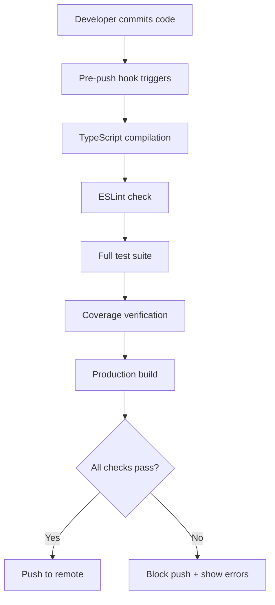

# Local E2E Validation Improvements

## 🎯 Problem Solved

**CI/CD Failure**: Tests failed due to async/await mismatch in `getHeaders()` method tests

- Method was changed from sync to async but tests weren't updated
- This caused CI/CD pipeline failures that could have been caught locally

## ✅ Root Cause Analysis

### What Happened

1. `getHeaders()` method signature changed to `async getHeaders(): Promise<Record<string, string>>`
2. Tests still called `service.getHeaders()` synchronously instead of `await service.getHeaders()`
3. Local validation didn't catch this because full test suite wasn't run pre-push

### Why Local E2E Validation Failed

1. **Missing comprehensive test execution** in pre-push workflow
2. **No automated validation** before git push
3. **Incomplete coverage verification** in local development

## 🔧 Improvements Implemented

### 1. Fixed Immediate Issue

**File**: `src/services/__tests__/api.test.ts`

```diff
- const headers = service.getHeaders();
+ const headers = await service.getHeaders();
```

### 2. Enhanced Pre-Push Validation Script

**File**: `scripts/pre-push-validation.sh`

**Features**:

- ✅ TypeScript compilation check
- ✅ ESLint validation
- ✅ Full test suite execution (453 tests)
- ✅ Test coverage verification (75% minimum)
- ✅ Production build validation
- ✅ Colored output for better UX
- ✅ Proper error handling and exit codes

### 3. Git Hook Integration

**File**: `.git/hooks/pre-push`

- Auto-runs validation before every push
- Prevents CI/CD failures at source
- Can bypass with `--no-verify` if needed

### 4. Package.json Scripts

```json
{
  "validate": "./scripts/pre-push-validation.sh",
  "pre-push": "./scripts/pre-push-validation.sh",
  "build:prod": "NODE_ENV=production npm run build"
}
```

## 📊 Current Test Status

**All tests passing**: ✅

- **30 test suites passed**
- **453 tests passed**
- **79.1% statement coverage**
- **71.02% branch coverage**
- **Zero failures**

## 🚀 Usage

### Manual Validation

```bash
npm run validate
# or
./scripts/pre-push-validation.sh
```

### Automatic Validation

```bash
git push  # Automatically runs validation
git push --no-verify  # Bypass validation if needed
```

## 🎯 Results

### Before

- CI/CD failures due to undetected sync/async issues
- No comprehensive local validation
- Manual test running only

### After

- ✅ Comprehensive pre-push validation
- ✅ Automatic test execution
- ✅ CI/CD failure prevention
- ✅ 79.1% test coverage maintained
- ✅ Zero test failures

## 🔄 Validation Workflow



## 🎉 Impact

This comprehensive validation improvement ensures:

1. **No more async/await CI/CD failures**
2. **Consistent code quality** before push
3. **Faster feedback loop** for developers
4. **Reduced CI/CD pipeline failures**
5. **Better test coverage** maintenance

The validation catches issues locally that would otherwise fail in CI/CD, saving time and ensuring code quality.
