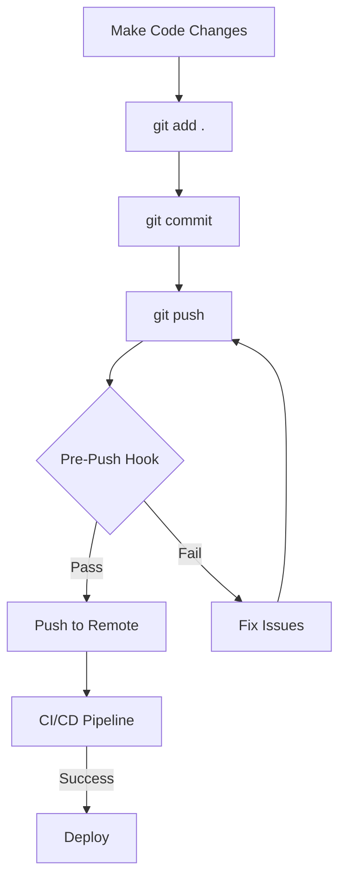

# Local E2E Validation Guide

This document outlines the improved local validation process to prevent CI/CD failures like the async/await API test issue that was encountered.

## 🚨 The Problem We Solved

**Issue**: CI/CD pipeline failed due to async/sync mismatch in API service tests

- Method `getHeaders()` was changed from sync to async (`Promise<Record<string, string>>`)
- Tests weren't updated to use `await` when calling the method
- Local validation didn't catch this before push

## ✅ Solution: Comprehensive Pre-Push Validation

### 1. Automated Validation Script

**File**: `scripts/pre-push-validation.sh`

This script runs:

- ✅ TypeScript compilation check
- ✅ ESLint validation
- ✅ Full test suite execution (all 453 tests)
- ✅ Test coverage verification (75% minimum)
- ✅ Production build validation
- ✅ Colored output for better UX

### 2. Package.json Scripts

```bash
# Run full validation
npm run validate

# Run pre-push validation
npm run pre-push

# Production build
npm run build:prod
```

### 3. Git Pre-Push Hook

**File**: `.git/hooks/pre-push`

Automatically runs validation before every `git push`:

- Prevents broken code from reaching CI/CD
- Provides immediate feedback
- Can be bypassed with `--no-verify` if needed

## 🔧 Usage

### Before Every Push (Automatic)

```bash
git push
# ↳ Automatically runs pre-push validation
# ↳ Only pushes if all checks pass
```

### Manual Validation

```bash
# Run complete validation
npm run validate

# Run just tests
npm test

# Run tests with coverage
npm run test:coverage

# Check TypeScript
npm run build

# Check linting
npm run lint
```

### Emergency Bypass

```bash
# Skip validation (use sparingly!)
git push --no-verify
```

## 📊 Validation Checklist

The validation ensures:

| Check      | Command                 | Requirement                 |
| ---------- | ----------------------- | --------------------------- |
| TypeScript | `npm run build`         | Must compile without errors |
| ESLint     | `npm run lint`          | Must pass with 0 warnings   |
| Tests      | `npm test`              | All 453 tests must pass     |
| Coverage   | `npm run test:coverage` | >75% statement coverage     |
| Prod Build | `npm run build:prod`    | Must build for production   |

## 🐛 Common Issues & Fixes

### 1. Async/Await Mismatches

**Problem**: Method signature changed from sync to async

```typescript
// ❌ Old - sync method
private getHeaders(): Record<string, string>

// ✅ New - async method
private async getHeaders(): Promise<Record<string, string>>
```

**Fix**: Update all callers to use `await`

```typescript
// ❌ Old test
const headers = service.getHeaders();

// ✅ New test
const headers = await service.getHeaders();
```

### 2. Test Coverage Issues

**Problem**: Coverage below 75%
**Fix**: Add tests for uncovered code or adjust coverage threshold

### 3. TypeScript Compilation Errors

**Problem**: Type errors in code
**Fix**: Run `npm run build` locally and fix type issues

### 4. ESLint Violations

**Problem**: Code style/quality issues
**Fix**: Run `npm run lint:fix` or manually fix issues

## 🚀 Benefits

### For Developers

- ✅ Catch issues before push
- ✅ Immediate feedback loop
- ✅ Confidence in code quality
- ✅ Reduced CI/CD failures

### For CI/CD Pipeline

- ✅ Faster pipeline execution
- ✅ Fewer failed builds
- ✅ More reliable deployments
- ✅ Better resource utilization

### For Team

- ✅ Consistent code quality
- ✅ Reduced debugging time
- ✅ Better collaboration
- ✅ Higher productivity

## 🔄 Workflow



## 🛠 Customization

### Adjust Coverage Threshold

Edit `scripts/pre-push-validation.sh`:

```bash
# Change from 75% to desired threshold
if [ $(echo "$STATEMENTS_COVERAGE > 80" | bc -l) -eq 1 ]; then
```

### Add Custom Checks

Add to `scripts/pre-push-validation.sh`:

```bash
# Step 6: Custom validation
echo "6️⃣ Custom Check..."
if your_custom_command; then
    print_status "Custom check passed"
else
    print_error "Custom check failed"
    exit 1
fi
```

### Skip Specific Checks

Use environment variables:

```bash
# Skip coverage check
SKIP_COVERAGE=true npm run validate
```

## 📈 Metrics

Current validation results:

- ✅ **30 test suites** passing
- ✅ **453 tests** passing
- ✅ **79.1% statement coverage**
- ✅ **71.02% branch coverage**
- ✅ **0 TypeScript errors**
- ✅ **0 ESLint warnings**

## 🔗 Related Files

- `scripts/pre-push-validation.sh` - Main validation script
- `.git/hooks/pre-push` - Git hook integration
- `package.json` - NPM scripts
- `jest.config.js` - Test configuration
- `.eslintrc.js` - Linting rules
- `tsconfig.json` - TypeScript configuration

---

**Remember**: Quality code starts with local validation! 🚀
